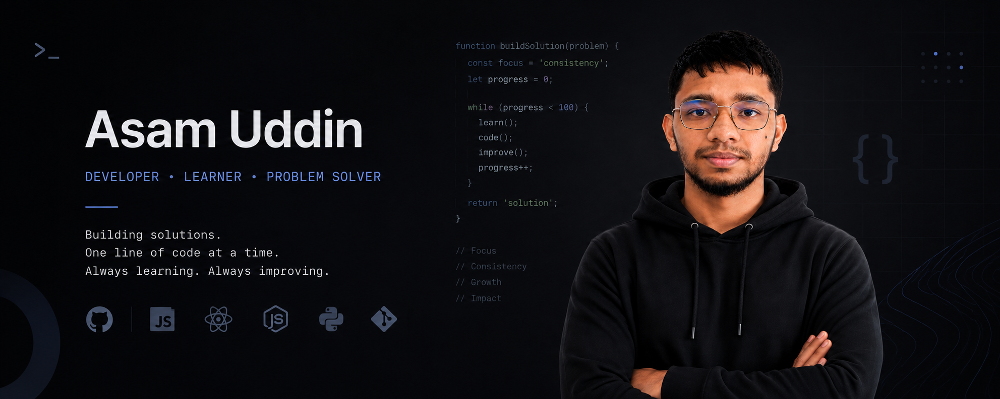

  

<h1 align="center">
  
</h1>

<h3 align="center">A passionate web development learner from Bangladesh</h3>

 

🌱 I'm currently learning **Next.js**

💻 I'm practicing **HTML, CSS, JavaScript and React**

🎯 I'm working toward becoming a **professional Full-Stack Web Developer**

💬 Ask me about **HTML, CSS, JavaScript or React**

 

<h1 align="center">⚒️ Tools and Technologies I Use ⚒️</h1>

 

<h3 align="left">
Languages :

</h3>

<h3 align="left">
Libraries and Frameworks :

</h3>

<h3 align="left">
Tools and Utilities :

</h3>

<h3 align="left">
Hosting and Deployment :

</h3>

<h3 align="left">
Operating System :

</h3>

<h1>---------------- Contributions ----------------</h1>

 

  

<h1>--------------------- Stats ---------------------</h1>

 

 

